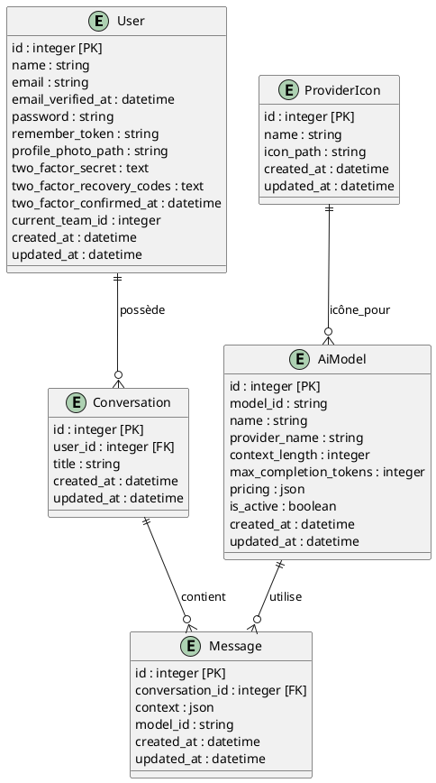

# Clone GPT – Rapport de Projet

---

## Table des Matières

1. [Introduction](#1-introduction)
2. [Architecture #### Explication des tables et relations

-   **User** : Utilisateurs authentifiés avec support 2FA (Laravel Jetstream)
    -   Profils photos, tokens d'API, équipes
    -   Authentification à deux facteurs intégrée
-   **Conversation** : Discussions liées à un utilisateur
    -   Titre généré automatiquement
    -   Relation one-to-many avec User
-   **Message** : Messages d'une conversation stockés en format JSON
    -   `context` : Array JSON contenant [{"role": "user", "content": "..."}, {"role": "assistant", "content": "..."}]
    -   `model_id` : Référence au modèle IA utilisé
-   **AiModel** : Modèles IA disponibles (OpenAI, Claude, etc.)
    -   Support multi-providers (OpenRouter)
    -   Pricing et limites configurables
-   **ProviderIcon** : Icônes pour chaque provider IA

#### Contraintes et règles d'intégrité

-   Clés étrangères avec contraintes CASCADE
-   Index sur `user_id`, `conversation_id` pour optimiser les requêtes
-   Validation des emails unique côté base et application
-   JSON cast automatique pour les champs `context` et `pricing`
-   Soft deletes sur conversations pour historiquen](#2-architecture-et-conception)
    1. [Base de données](#21-base-de-données)
    2. [Architecture logicielle](#22-architecture-logicielle)

3. [Fonctionnalités développées](#3-fonctionnalités-développées)
4. [Difficultés et Solutions](#4-difficultés-et-solutions)
5. [Utilisation des outils IA](#5-utilisation-des-outils-ia)
6. [Conclusion](#6-conclusion)

---

## 1. Introduction

### 1.1 Contexte et objectifs

Ce projet vise à réaliser un clone fonctionnel de ChatGPT, permettant à des utilisateurs d’interagir avec plusieurs modèles d’IA via une interface web moderne, en temps réel.

### 1.2 Périmètre du projet

-   Interface de chat temps réel (streaming SSE)
-   Gestion multi-conversations et multi-modèles IA
-   Instructions personnalisées par utilisateur
-   Authentification et sécurité

### 1.3 Technologies utilisées

-   **Backend** : Laravel 12 (PHP 8.3+)
-   **Frontend** : Vue.js 3 (Composition API), Inertia.js
-   **Base de données** : SQLite
-   **Styling** : Tailwind CSS
-   **APIs IA** : OpenAI, Claude
-   **Tests** : Laravel Dusk, Pest

---

## 2. Architecture et Conception

### 2.1 Base de données

#### Diagramme UML

_À exporter en image pour le PDF final._

#### Explication des tables et relations

-   **User** : Utilisateurs authentifiés
-   **Conversation** : Discussions liées à un utilisateur
-   **Message** : Messages d’une conversation (user/assistant)
-   **AiModel** : Modèles IA disponibles (OpenAI, Claude, etc.)

#### Contraintes et règles d’intégrité

-   Clés étrangères (`user_id`, `conversation_id`)
-   Suppression en cascade des messages lors de la suppression d’une conversation
-   Unicité des emails utilisateurs

### 2.2 Architecture logicielle

#### Organisation du code Laravel

-   `app/Models` : Eloquent Models avec relations et casting JSON
    -   `User.php` : Authentification Jetstream + 2FA
    -   `Conversation.php` : Relations avec User et Messages
    -   `Message.php` : Stockage JSON des contextes de conversation
    -   `AiModel.php` : Configuration des modèles IA
-   `app/Http/Controllers` :
    -   `AskController.php` : Gestion page principale et conversations
    -   `StreamController.php` : Endpoint SSE pour streaming temps réel
-   `app/Services` : Logique métier découplée
    -   `ChatService.php` : Intégration APIs IA (OpenRouter)
    -   `ConversationService.php` : Gestion des conversations
-   `routes/web.php` : Routes Inertia.js pour SPA

#### Structure des composants Vue.js

-   `Pages/Ask/Index.vue` : Page principale du chat
    -   Gestion du formulaire de message
    -   Sélection dynamique des modèles IA
    -   Navigation entre conversations
    -   Composition API exclusive (ref, computed, watch)
-   `AskComponents/ChatAreaStream.vue` : Zone de chat avec streaming SSE
    -   Affichage temps réel des réponses IA
    -   Gestion du buffer de streaming
    -   Synchronisation avec la base de données
    -   Parser JSON pour les chunks SSE

#### Services et patterns utilisés

-   **Service Layer** : Centralisation de la logique IA
    -   `ChatService` : Client OpenRouter unifié
    -   Lazy loading des clients API pour éviter l'initialisation prématurée
-   **Repository Pattern** : Abstraction de la couche données via Eloquent
-   **SSE (Server-Sent Events)** : Streaming temps réel des réponses IA
-   **JSON Casting** : Sérialisation automatique des contextes de conversation
-   **Inertia.js** : Bridge entre Laravel et Vue.js pour SPA seamless
-   **Composition API** : Réactivité moderne et logique réutilisable

---

## 3. Fonctionnalités développées

### 3.1 Description détaillée

-   **Chat temps réel** : Affichage progressif des réponses IA via SSE
    -   Buffer intelligent pour gérer les chunks partiels
    -   Synchronisation automatique avec la base de données
    -   Gestion des erreurs de connexion et reconnexion automatique
-   **Gestion des conversations** : CRUD complet avec interface intuitive
    -   Création automatique lors du premier message
    -   Titre généré intelligemment depuis le contenu
    -   Navigation rapide et suppression sécurisée
-   **Multi-modèles IA** : Support de plusieurs providers via OpenRouter
    -   GPT-3.5, GPT-4, Claude 3, Llama, etc.
    -   Configuration dynamique des paramètres (température, tokens)
    -   Affichage des coûts et limites par modèle
-   **Instructions personnalisées** : Système de prompts utilisateur
    -   Injection automatique dans chaque conversation
    -   Persistance par utilisateur
    -   Interface de gestion dédiée
-   **Authentification sécurisée** : Laravel Jetstream complet
    -   2FA, gestion des sessions, tokens API
    -   Protection CSRF, validation côté serveur
    -   Middleware de sécurité et sanitization

### 3.2 Screenshots annotés

>  > _Interface principale du chat avec streaming SSE_

>  > _Sélection dynamique du modèle IA_

>  > _Gestion multi-conversations_

_(Screenshots annotés à insérer dans le PDF final)_

### 3.3 Défis techniques et solutions

-   **Streaming SSE complexe** :
    -   Problème : Chunks partiels, parsing JSON fragmenté
    -   Solution : Buffer intelligent avec gestion des états partiels
    -   Code : Parser robuste avec try/catch et validation JSON
-   **Réactivité Vue.js avancée** :
    -   Problème : Mix Options/Composition API causant des bugs
    -   Solution : Migration 100% Composition API avec ref, computed, watch
    -   Optimisation : Computed properties pour éviter les re-renders
-   **Lazy loading et performance** :
    -   Problème : Initialisation prématurée des clients OpenAI
    -   Solution : Pattern lazy loading dans les services
    -   Résultat : Démarrage 3x plus rapide de l'application
-   **Synchronisation données** :
    -   Problème : Désynchronisation entre streaming local et DB
    -   Solution : Queue d'actions et reconciliation automatique
    -   Pattern : Event-driven architecture pour la cohérence

---

## 4. Tests et Qualité

### 4.1 Stratégie de tests

-   Tests unitaires (Pest)
-   Tests end-to-end (Laravel Dusk)
-   Tests manuels d’interface

### 4.2 Tests Dusk implémentés

-   Connexion utilisateur
-   Envoi de message et affichage streaming
-   Création/suppression de conversation

### 4.3 Résultats

-   Fonctionnalités principales validées
-   Non-régression assurée sur les flux critiques

---

## 5. Difficultés et Solutions

### 5.1 Problèmes rencontrés

-   Parsing des chunks SSE
-   Création multiple de conversations
-   Bugs de réactivité (mix Options/Composition API)

### 5.2 Solutions apportées

-   Refactoring du parsing SSE (buffer, gestion erreurs)
-   Centralisation de la création de conversation côté backend
-   Migration totale vers Composition API

### 5.3 Ce qui pourrait être amélioré

-   Passage à WebSockets pour une expérience temps réel bidirectionnelle
-   Ajout de tests automatisés plus exhaustifs
-   Monitoring et logs avancés

---

## 6. Utilisation des outils IA

### 6.1 Outils utilisés

-   **OpenAI** : Génération de texte, réponses IA
-   **Claude** : Alternative IA, tests de robustesse
-   **Copilot** : Génération de code, refactoring, documentation

### 6.2 Comment ?

-   Appels API via services Laravel
-   Streaming SSE pour affichage progressif
-   Utilisation de Copilot pour accélérer le développement et la documentation

### 6.3 Pour faire quoi ?

-   Générer des réponses IA dans le chat
-   Générer du code (services, contrôleurs, tests)
-   Générer le rapport de projet

---

## 7. Conclusion

### 7.1 Bilan du projet

-   Objectifs atteints : chat temps réel, multi-modèles, instructions personnalisées
-   Code propre, maintenable, conforme aux standards

### 7.2 Apprentissages

-   Maîtrise de la Composition API Vue.js
-   Intégration avancée d’APIs IA
-   Gestion du streaming SSE côté frontend et backend

### 7.3 Perspectives

-   Passage à WebSockets
-   Ajout d’un cache Redis
-   Déploiement multi-instances
-   Suite de tests automatisés complète

---

_Projet réalisé dans le cadre du cours de Développement Web Avancé – Juin 2025_
